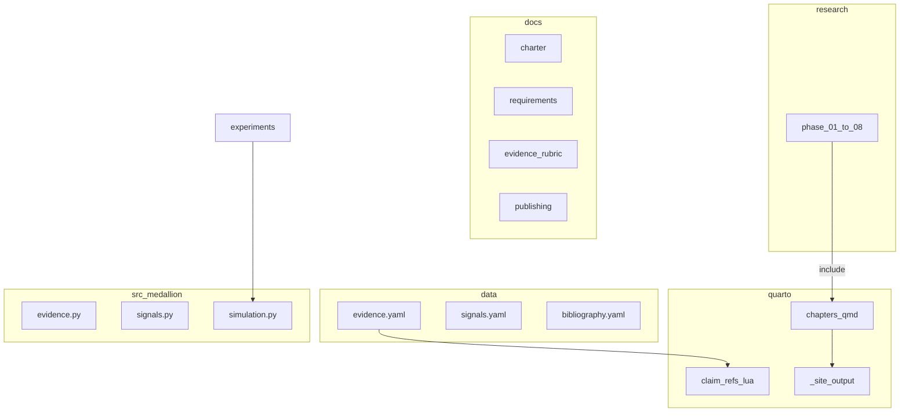

# System Architecture

## Overview

Monorepo combining an **evidence-graded research corpus** (`research/`), a **Quarto public website** (`quarto/`), a **reproducible Python package** (`src/medallion/`), and **numbered experiments** (`experiments/`). Structured data lives in `data/` as YAML; schemas in `schemas/` validate records.



## Repository Layout

```text
medallion/
  docs/                 # SDLC + publishing docs
  quarto/               # Public Quarto website
    _quarto.yml
    chapters/
    appendices/
    filters/
  schemas/
  data/
  research/
  src/medallion/
  experiments/
  scripts/              # claim_audit, build_quarto_assets
  tests/
  .github/workflows/    # quarto-publish (Pages when public)
  pyproject.toml
  Makefile
```

## Data Model

See schemas in `schemas/`. Evidence and signals stored in `data/*.yaml`.

## Publication Pipeline

1. `make quarto-assets` — bibliography.bib, appendices, claims-map.json
2. `make claim-audit` — research claim IDs valid
3. `quarto render quarto` — claim-refs.lua resolves `[[claim:...]]`
4. Output: `quarto/_site/` (gitignored)

When the GitHub repo is public: enable Pages from GitHub Actions workflow.

## Tooling

| Component | Choice |
|-----------|--------|
| Python | 3.11+ |
| Quarto | System CLI (website) |
| Package manager | uv / pip |
| Validation | jsonschema, claim audit, Quarto build |

## Key Flows

### Adding a claim

1. Add row to `data/evidence.yaml`
2. Reference in research: `[[claim:CLM-YYYY-NNN]]`
3. `make claim-audit` and `make site`

### Release

- `make reproduce` — code QA
- `make site` — public site build

## Versioning

Corpus, site, and code share semver. v0.2.0 adds Quarto publication.

## Security

No secrets in repo. `_site/` and `.venv/` gitignored.
