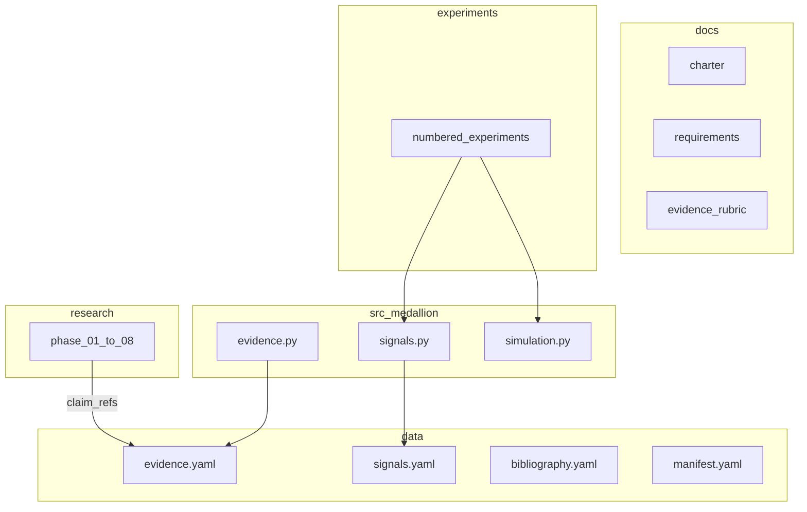

# System Architecture

## Overview

Monorepo combining an **evidence-graded research corpus** (`research/`) with a **reproducible Python package** (`src/medallion/`) and **numbered experiments** (`experiments/`). Structured data lives in `data/` as YAML; schemas in `schemas/` validate records.



## Repository Layout

```text
medallion/
  docs/                 # SDLC documentation
  schemas/              # JSON Schema for evidence, signals, experiments
  data/                 # YAML databases (committed, small)
  research/             # Phase write-ups (markdown)
  src/medallion/        # Shared Python library
  experiments/          # One folder per experiment
  r/                    # Optional R scripts
  scripts/              # claim_audit, build_db
  tests/                # pytest
  pyproject.toml
  Makefile
  README.md
  CHANGELOG.md
```

## Data Model

### Evidence record

See `schemas/evidence_record.schema.json`. Stored in `data/evidence.yaml` as a list under `claims`.

### Signal hypothesis

See `schemas/signal_hypothesis.schema.json`. Stored in `data/signals.yaml` under `signals`.

### Experiment contract

See `schemas/experiment_contract.schema.json`. Each experiment folder has `contract.yaml`.

## Tooling

| Component | Choice | Notes |
|-----------|--------|-------|
| Python | 3.11+ | Primary language |
| Package manager | pip + pyproject.toml | `pip install -e ".[dev]"` |
| Backtesting | vectorbt (light use) + custom sim in `simulation.py` | Avoid duplicate frameworks |
| Stats | statsmodels, numpy, pandas | Core stack |
| R | Optional | `r/cointegration_example.R` for reference |
| Validation | jsonschema | Load YAML, validate against schemas |
| Tests | pytest | Unit + smoke |

Optional later: PyMC, PyTorch, jax — only when a hypothesis requires them (YAGNI).

## Key Flows

### Adding a claim

1. Add row to `data/evidence.yaml`
2. Reference in research: `[[claim:CLM-YYYY-NNN]]`
3. Run `make claim-audit`

### Running an experiment

1. Read `experiments/NN_name/contract.yaml`
2. Run `python -m experiments.NN_name.run` or `make experiment-NN`
3. Results written to `experiments/NN_name/results/` (gitignored if large)

### Release

`make reproduce` → install deps → tests → smoke experiments → claim audit

## Versioning

Corpus and code share semver (e.g. v0.1.0). Tag git release; snapshot `data/*.yaml` in release notes.

## Security

No secrets in repo. External data paths documented in `data/manifest.yaml` only.
