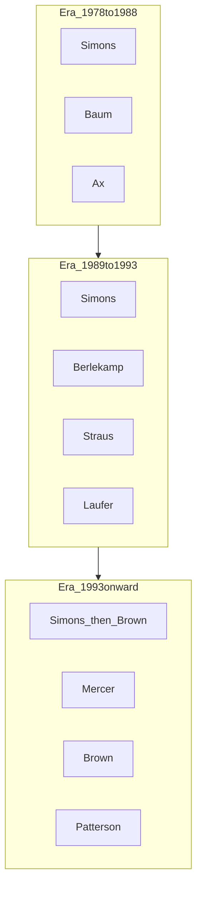

# Personnel Contribution Matrix {#personnel-contribution-matrix}

Sources: [@zuckerman2019], [@patterson2010], [@wikipedia_renaissance_technologies], [@berkeley_news_berlekamp2019]. See [disclaimer](../about.html).

## Matrix (high level)

| Figure | Active period (public) | Documented contribution | Claim ref |
|--------|------------------------|---------------------------|-----------|
| **Jim Simons** | 1978–2024 (life); CEO to 2009 | Founder; Monemetrics→Renaissance; scientific hiring; Medallion architecture | [[claim:CLM-2024-001]] [[claim:CLM-2026-001]] [[claim:CLM-2026-013]] [[claim:CLM-2026-021]] |
| **Howard L. Morgan** | 1978– (early) | Co-founder Monemetrics in public summaries | [[claim:CLM-2026-002]] |
| **Leonard Baum** | ~late 1970s–1980s | Early statistical currency models; Baum–Welch lineage | [[claim:CLM-2026-010]] |
| **James Ax** | 1980s–1989 | Extended models toward commodity futures; Medallion predecessor; departed 1989 | [[claim:CLM-2026-011]] [[claim:CLM-2026-005]] |
| **Elwyn Berlekamp** | 1989–1990 (Medallion leadership episode) | Six-month overhaul; 1990 rebound; sold stake back to Simons | [[claim:CLM-2024-005]] [[claim:CLM-2026-006]] |
| **Sandor Straus** | 1990s onward (public) | Ran revamped trading system after Berlekamp per timelines | [[claim:CLM-2026-009]] |
| **Henry Laufer** | early 1990s (consultant) | Named in overhaul cohort | [[claim:CLM-2026-015]] |
| **Nick Patterson** | 1990s onward | Genomics→quant bridge; hiring/culture influence | [[claim:CLM-2026-014]] |
| **Robert Mercer** | 1993– | IBM speech / computational linguistics; later executive leadership | [[claim:CLM-2024-006]] [[claim:CLM-2026-013]] |
| **Peter Brown** | 1993– | IBM speech / computational linguistics; later CEO (current era) | [[claim:CLM-2024-006]] [[claim:CLM-2026-013]] |

## Mini-bios (public record)

### Jim Simons

Chern–Simons work and Stony Brook chairmanship predate finance. Public timelines emphasize code-breaking / IDA experience as culture-shaping [[claim:CLM-2026-003]]. He remained intertwined with Renaissance through chairman era and personal investment narratives until his death in **2024** [[claim:CLM-2026-021]].

### Leonard Baum and James Ax

**Baum:** early algorithmic currency work; later moved away from pure systematic modeling in public accounts [[claim:CLM-2026-010]]. **Ax:** expanded modeling scope and helped structure entities feeding Medallion; left after **1989** drawdown dispute [[claim:CLM-2026-005]] [[claim:CLM-2026-011]].

### Elwyn Berlekamp

UC Berkeley mathematician and coding theorist; **Axcom / Medallion** presidency in public CV summaries; obituary coverage details **1990** sale of stake back to Simons and return to academia [[claim:CLM-2026-006]] [@berkeley_news_berlekamp2019].

### Sandor Straus and Henry Laufer

**Straus:** operational continuity after Berlekamp per Wikipedia-cited annual report summaries [[claim:CLM-2026-009]]. **Laufer:** consultant on early-1990s overhaul [[claim:CLM-2026-015]]; later-era public roles are outside this Phase I scope.

### Nick Patterson

Computational **genomics** background; Zuckerman/Patterson narratives describe influence on **hiring** and scientific culture rather than a single public “alpha formula” [[claim:CLM-2026-014]].

### Robert Mercer and Peter Brown

Joined **1993** from **IBM Research** (computational linguistics / speech), not the often-cited “late 1990s” casual date [[claim:CLM-2024-006]]. Public material links them to later **executive leadership** after Simons’s CEO retirement [[claim:CLM-2026-013]]. Internal division of labor (research vs execution vs infrastructure) is **not** verifiable from outside [[claim:CLM-2026-018]].

## Handoff diagram (roles are approximate)

## Organizational insight (hypothesis-grade)

Scientist-first hiring and secrecy may be durable edge [[claim:CLM-2024-009]], but peers share pieces of the recipe without identical outcomes—**necessary, not sufficient**.

## What is not publicly knowable

Precise **headcount reporting lines**, **code review** practices, and **compensation** mechanics for researchers vs execution are largely outside the evidence base [[claim:CLM-2026-018]].
