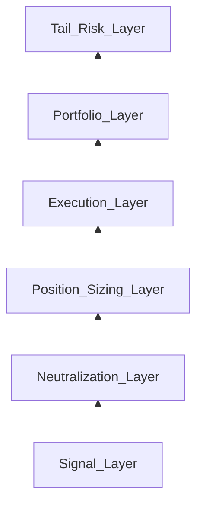

# Risk Stack Reconstruction

Six layers (bottom to top):

## Layer descriptions

| Layer | Function | Plausible Medallion mechanisms |
|-------|----------|------------------------------|
| 1. Signal | Generate forecasts | Stat arb, momentum, micro, options (SIG-001–014) |
| 2. Neutralization | Factor/market beta removal | Industry-standard for market-neutral funds |
| 3. Position sizing | Vol targeting, Kelly variants | [[claim:CLM-2024-004]] band 5×–12×; SIG-015 |
| 4. Execution | Minimize impact and timing | AC/Kyle frameworks; RL inference SIG-014 |
| 5. Portfolio | Correlation control, leverage | Diversification across instruments |
| 6. Tail risk | Crisis behavior | Drawdown control; we hypothesize active de-grossing |

## Performance metrics

Reported gross Sharpe is often cited above 5 in secondary sources; exact values are not publicly audited [[claim:CLM-2024-003]]. We treat point estimates like 7–10 as **speculative upper range**, not replicated facts.

Leverage should be stated as a **band** [[claim:CLM-2024-004]].

## Experiment

[experiments/05_vol_target_kelly/](../../experiments/05_vol_target_kelly/) — vol-target with banded leverage and costs.

Requirement: R5, R5b
