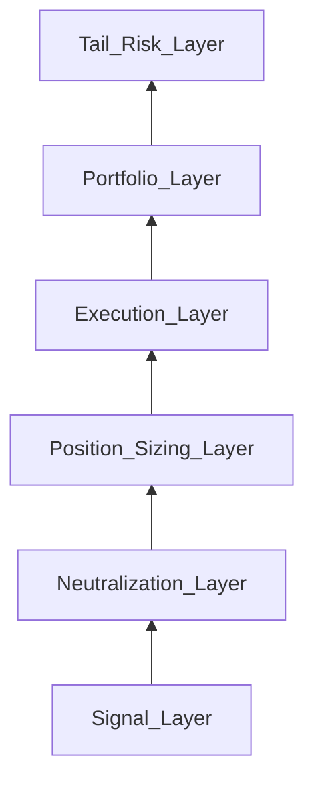

# Risk Stack Reconstruction

**Last updated:** 2026-05-28

Six layers (bottom to top) reconstruct how a market-neutral quant flagship **might** translate signals into reported risk-adjusted returns. All leverage and Sharpe statements use **ranges or hypothesis labels** per [[claim:CLM-2024-003]] [[claim:CLM-2024-004]].

## Layer 1 — Signal

**Function:** Generate forecasts across instruments and horizons.

**Plausible Medallion mechanisms:** Stat arb, momentum, microstructure, options sleeves (SIG-001–014). Diversification across **uncorrelated** short-horizon edges supports high gross Sharpe in narrative accounts; we do not observe weights.

**Failure modes:** Regime shifts, crowding, structural breaks (SIG-004, SIG-005).

## Layer 2 — Neutralization

**Function:** Remove factor and market beta exposure.

**Mechanisms:** Industry-standard for market-neutral funds — industry, beta, and style factors (inferred). Pairs with SIG-001 residual construction.

**Evidence:** E2 industry practice; RenTech-specific factor set unknown.

## Layer 3 — Position sizing

**Function:** Translate forecasts into weights under risk budgets.

**Mechanisms:** Volatility targeting, fractional Kelly variants (SIG-015). Public leverage band **~5×–12× effective** is hypothesis E1 [[claim:CLM-2024-004]], not a fixed constant.

**Experiment:** [EXP-05](https://github.com/nvavrock/medallion/tree/main/experiments/05_vol_target_kelly) — EXP-05 applies banded leverage with commission and slippage; compare gross versus net Sharpe in `results/summary.json`.

## Layer 4 — Execution

**Function:** Minimize implementation shortfall and timing risk.

**Mechanisms:** Almgren–Chriss / Kyle frameworks; possible adaptive execution (SIG-014 E1). EXP-04 shows execution drag can erode naive alpha.

**Link:** [Phase IV — Execution](../chapters/04-execution.html).

## Layer 5 — Portfolio

**Function:** Correlation control, capital allocation, leverage at fund level.

**Mechanisms:** Cross-asset diversification (futures, FX, equities per [[claim:CLM-2024-002]]); capacity management when Medallion closed to outsiders [[claim:CLM-2026-007]].

**Metrics (ranges, not point claims):**

| Metric | Public reconstruction stance |
|--------|------------------------------|
| Gross Sharpe | Often cited **>5** in secondary sources; treat **~3–7+** as speculative band pending audit [[claim:CLM-2024-003]] |
| Net Sharpe | Lower than gross; fees and capacity not precisely public |
| Leverage | Band **~5×–12×** effective (E1) [[claim:CLM-2024-004]] |

## Layer 6 — Tail risk

**Function:** Crisis behavior, drawdown control, de-grossing.

**Mechanisms:** Active de-grossing (inferred); contrast with LTCM-style convergence and leverage [[claim:CLM-2024-010]]. Shorter holding periods and diversification (inferred) differ from failed peer profiles.

**Failure modes:** Correlation breakdown (SIG-010), vol spikes (SIG-009), liquidity freezes.

## Stack conclusion

No single layer explains Medallion in public data. Signal diversity plus sizing and execution discipline are **plausible necessary** components; precise attribution is **not** publicly identifiable.

Requirement: R5, R5b
