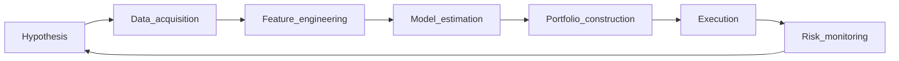

# Research workflow (inferred) {#research-workflow}

**Last updated:** 2026-05-28

## Stages (E1–E2 inference)

| Stage | Medallion hypothesis | Public evidence |
|-------|---------------------|-----------------|
| Hypothesis | Scientist-led, long R&D | [[claim:CLM-2024-009]] |
| Data | Proprietary cleaning | [[claim:CLM-2026-019]] |
| Models | Ensemble / stat-arb | Phase III signals |
| Portfolio | Neutralized, vol-targeted | Phase V |
| Execution | Low drag | [[claim:CLM-2024-007]] |
| Risk | De-gross in stress | [[claim:CLM-2024-010]] contrast |

Peers may share stages; differentiation is **integration and secrecy**, not a single publicized invention.

Requirement: R6 (workflow deliverable)
